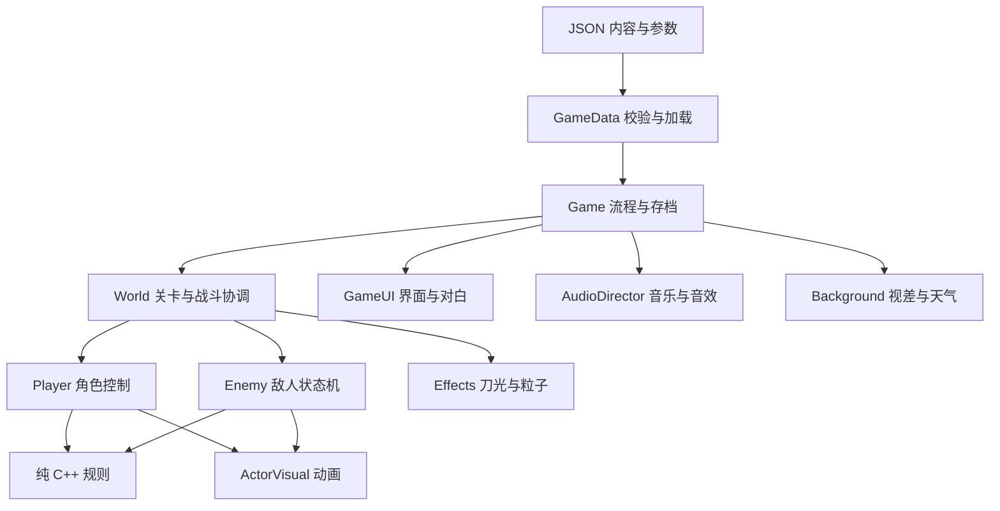

# 架构与扩展指南

## 分层

## 模块职责

- `core/rules.h`：无引擎依赖的生命、无敌窗口、跳跃缓冲、Boss 阶段和进度边界。单位测试直接编译该层。
- `core/game_data.*`：唯一的数据加载入口。将 JSON 转换为明确的 `MovementTuning`、`EnemyTuning`、`RoomData`、`DialogueLine`，并在实例化关卡前检查关键字段。
- `core/game.*`：组合根。管理菜单/游戏/对白/暂停/死亡/命名/结束状态、切章、存档及系统输入。它负责连接模块回调；敌人与角色不直接切换游戏场景。
- `actors/player.*`：Godot `CharacterBody2D` 控制器。输入来自 `InputMap`，120 Hz 固定物理更新。移动参数来自数据。攻击向关卡提交世界坐标矩形，不直接查找敌人。
- `actors/enemy.*`：巡逻 → 预警 → 出招 → 收招状态机，另有受击与死亡状态。弓手发射请求，Boss 发出法术请求；具体伤害由 World 协调。Boss 保留出招动作，避免被无限硬直锁死。
- `actors/actor_visual.*`：独立于碰撞的图像动画。所有图像以脚底为统一原点。切换皮肤不改变命中盒。
- `world/world.*`：读取当前关卡的静态几何，创建角色与敌人，处理双方攻击、箭矢反射、封印、法术、出口、镜头震动和关卡内叙事触发。
- `world/effects.*`：表现层粒子、刀光、残影，不参与伤害判断。
- `world/background.*`：画面背景、视差、雨、日出，不参与物理。
- `ui/game_ui.*`：只读取 `UiModel`；按钮输出动作意图。命名使用 Godot 原生 `LineEdit`，支持中文输入法。
- `audio/audio_director.*`：音乐循环与八声道音效池；静音统一在该模块处理。

## 生命周期与通信

Godot 节点树拥有全部运行时节点。`Game` 拥有当前 `World`，`World` 拥有敌人和角色。关卡切换先停止旧关卡的处理并隐藏，再 `queue_free()`，避免物理回调中立即销毁节点。过场期间禁用 World 子树，UI 和音频继续运行。正常退出先停止音频，再给音频线程一小段清理时间，避免循环音源在引擎关闭时仍被引用。

模块使用组合根连接的类型明确的 C++ `std::function` 回调，例如 `Player::on_attack`、`Enemy::on_command`、`World::on_decree_cut`。这些回调仅在所属关卡存活期间使用；不得把旧关卡的节点指针保存在跨关卡对象中。Godot 原生 UI 信号通过 `ClassDB` 绑定的方法接入。

目前敌人死亡后停止互动并保留节点到本章结束，以保持 World 中的引用有效。扩大到数百敌人的长期关卡时，应增加对象池或基于 `ObjectID` 的实体注册表，而不是在当前引用列表中直接释放对象。

命中判定采用明确的 2D AABB，环境碰撞由 Godot 原生物理处理。小规模短关卡使用线性命中遍历，方便调试。若增加大型关卡，可以在 World 的攻击分发处替换为空间索引或 Area2D，不需要修改角色输入或剧情。

## 数据约定

`rooms.json` 的位置单位为像素，坐标向右、向下递增。

- `platforms`：`[x, y, width, height]`，顶边就是可站立高度。厚度不超过 40 的平台允许从下方跳穿。
- `spawn` / 敌人 `at`：角色脚底坐标。
- `patrol`：敌人的水平活动范围 `[left, right]`，应落在对应平台范围内。
- `seals` / `decree`：可斩对象中心点。
- `exit`：门的上部坐标，交互中心在其下方 90 像素。
- `next`：后续关卡 ID。保存进度也使用稳定 ID，调整关卡排列不会把已有存档指向错误章节。
- `intro`：进入章节立即播放的对白 ID。
- `story` / `story_x`：走到指定水平位置时播放一次的对白。
- `hints`：随前进更新的操作提示。

关卡宽度至少 1280。角色原点位于脚底，普通角色碰撞高 72，宽 30。跳跃高度约为 `jump_speed² / (2 * gravity)`；调整平台高度前检查这个值。跳跃距离取决于按键释放时间和突进，因此可达性验证需要使用真实角色控制器。

## 添加内容

### 增加普通章节

1. 在 `rooms.json` 添加一项，配置平台、出生点、敌人、封印和出口。
2. 在 `story.json` 添加对应对白 ID。
3. 使用关卡的 `next` 字段填写下一个关卡 ID；正常出口与 Boss 战胜利都通过该字段推进，不依赖数组编号。
4. 使用 `--room=N` 预览，再实际测试跳跃和出口。预览不会覆盖玩家存档。

### 增加敌人

1. 在 `tuning.json` 的 `enemies` 中定义新类型数值。
2. 在 `Enemy` 的状态机中添加特有攻击，优先通过现有攻击/射击/命令回调表达。
3. 添加同名皮肤的 `idle/run/jump/attack/dash` 帧；新角色使用 `assets/characters/redesign/` 下的 PNG 图集及 `.tres` 帧资源，缺失时会读取旧 SVG。
4. 在关卡 `enemies` 中放置该类型。

如敌人种类继续增加，应提取 `EnemyAttackPattern` 策略接口，避免把每种行为持续堆入状态机。当前三种敌人共享移动与生命管理。

### 替换角色图像

`tools/draw_assets.py` 生成的 SVG 是可编辑源素材。可直接编辑输出 SVG，也可以修改生成脚本后重新生成。再次运行脚本会覆盖其生成的 SVG 和 WAV，手工修改前请保留自定义文件。

当前五类角色采用内置图像生成工具绘制的透明 PNG 图集。`tools/import_character_atlases.py` 根据 `layout.json` 生成 65 个 `AtlasTexture`，保留原来的动画数量和速率。`ActorVisual::load_frame()`、`frame_rect()` 和 `draw_frame()` 统一战斗人物、标题人物、老人和残影的加载与绘制；少数紧密相邻的姿势由资源元数据中的分段区域隔离。详见 [角色重设计](CHARACTER_REDESIGN.md)。

## 构建与依赖

`godot-cpp` 固定到提交 `6cceaf6a5f8b0d78ac5d71c139fd7fabba43b918`，使用其 4.6 API。`build_profile.json` 限制生成类范围，加速构建。使用新的 Godot 类或 API 返回类型时，需要将相应类加入该文件。

GDExtension 文件只声明如何加载动态库；它不会编译 C++。当前动态库输出路径为 `game/bin/libzhanling.dylib`。Windows 下为 `zhanling.dll`，Linux 下为 `libzhanling.so`，需要各自平台工具链编译。

## 验证边界

- `rules_tests` 覆盖重复受击、无敌时间、死亡幂等、跳跃宽限、输入缓冲、Boss 阶段只触发一次、存档边界等纯规则。
- `IntegrationRunner` 只在 `--smoke-test` 启动参数下工作，通过真实 Godot 输入和物理验证移动、跳跃、落地、突进与攻击，再通过明确的测试定位验证关卡生命周期、封印、Boss 阶段、法术打断、斩令、Unicode 命名及存档。
- 集成测试另外用真实跳跃/突进验证 9 条关键平台路线，并验证敌方箭矢的瞄准、反射及反伤。测试会直接定位到路线起点，章节跳转与部分战斗定位也是测试设施，不等同于完整人工通关；关卡难度和整体节奏仍应通过试玩调整。
- 游戏运行不需要 Python。Python 只负责构建、绘制素材、生成音频和辅助验证。
